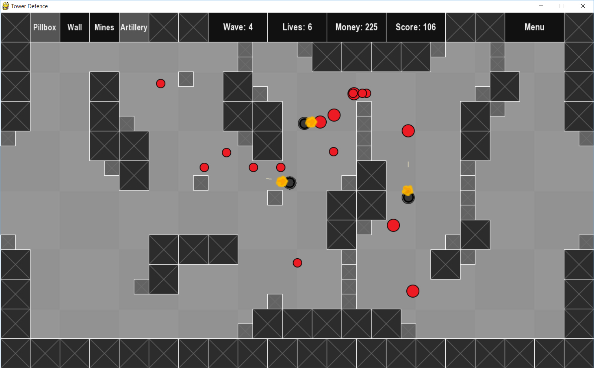
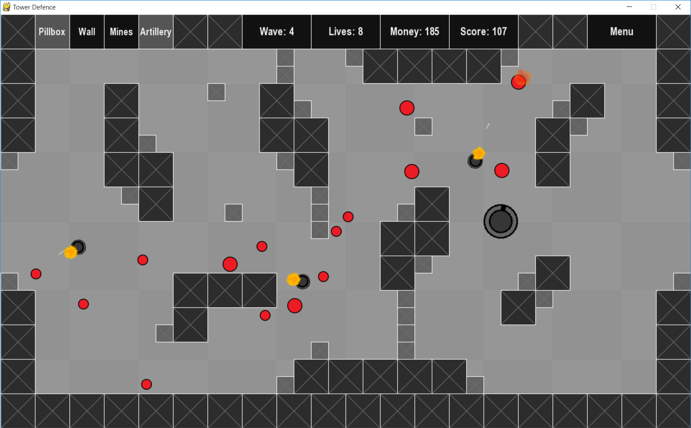
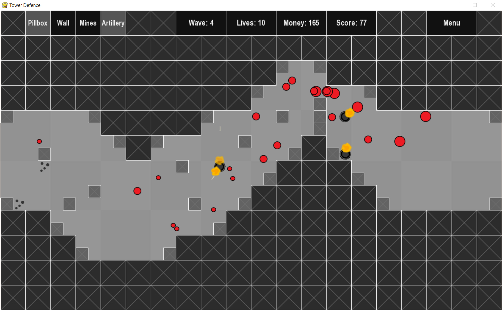

# Python Tower Defence Game
A small Python game, written during the first year of my Computer Science degree.

## Main Features
- Pygame sprites, with sprite sheet animations for explosions
- Pathfinding using Dijkstra's algorithm, with path reusing and repairing
- Custom file format for prefabs and levels, explained by readmes in the prefabs/ and levels/ directories
- Multiple level files, demonstrating the pathfinding in different conditions
- Online leaderboard, creating using an asp.net api hosted in Windows Azure

## Description
A tower defence game, where the player must place defences to stop waves of enemies escaping. Each wave
is stronger than the last, with enemies avoiding player-placed obstacles and taking multiple routes to reach the finish.

## How To Run
- Install Python 3 and Pygame (tested with Python 3.2 and Pygame 1.9.2)
- Fetch the project
- Run main.py

## Screenshots

